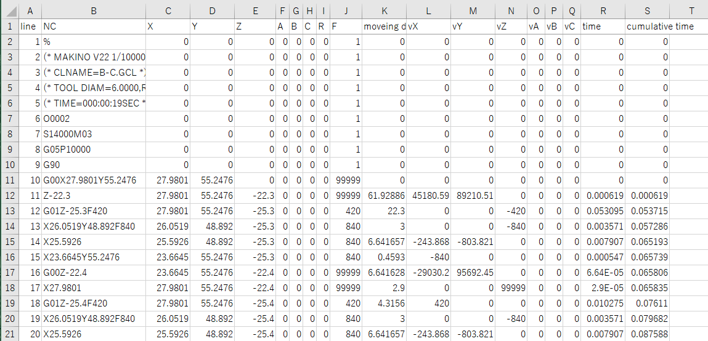

# NCプログラム解析器

[](https://godoc.org/github.com/xcd0/nc2csv)

NCプログラムを読み込み、分析して、各軸座標位置、各行の送り速度、移動時間 などをある程度見やすく出力する。  

* in : nc プログラム (テキストファイル、拡張子不定)  
* out : 1行ごとの各軸の動作、送り速度の解析結果 (csv または同等の表現をできる一般的なフォーマット)  
gui はつけてもつけなくてもいいが、必須ではない。

出力データの1行 (解析用に項目追加可能性あり)

```
元ncプログラムの行、XYZABC の各位置、プログラムの F、XYZABC の各軸速度、移動に要する時間
```

サンプルとして`/doc/testcut/b-c.NCD`を当プログラムでcsvに変換し、  
列幅など整えたxlsxファイルを`/doc/b-c.NCD.xlsx`に置く。  
中身は下記の画像のような見た目である。  
2列目が元のNCプログラムで、3列目以降がそれを解析したものになる。



初期値未指定などの場合は、わかりませんの意で不定値を書く。  
現状外部ファイルからの読み込みに対応していないので、  
G00の早送り速度は99999、G01の送り速度は1にしている。  
その他の初期値も適当な値に設定している。  
将来的には外部ファイル読み込みを実装する。  

詳しい仕様は`/doc/specification.md`を見ること。

## Windowsにおける環境設定
windows以外はたいして難しくないので割愛する。
windowsはシェルが...

1. シェルを用意
なんでもよい。おおむね4パターン方法がある。

	* Msys2([http://www.msys2.org/](http://www.msys2.org/))
		1. [MSYS2 http://repo.msys2.org/distrib/x86_64/msys2-x86_64-20190524.exe](http://repo.msys2.org/distrib/x86_64/msys2-x86_64-20190524.exe) からダウンロードしてインストール。
		1. `pacman -Syuu` を実行し、アップデートする。
		1. アップデート完了後、英語で一旦Msysを再起動せよとメッセージが出るので、  
		ウィンドウを×ボタンで閉じて再度開く。
		1. `pacman -S git make wget` でgitとmakeを入れる。vimなど必要があれば入れる。

	* WSL (StoreアプリからUbuntu等をインストールする)
		1. OSの初期設定は検索して行う。
		1. 初期設定が終わったら、gitとmake、wgetを入れる。  
		ubuntuなら`sudo apt update` を実行してパッケージリストをアップデートしたのちに  
	   	`sudo apt install git make wget`を実行する。

	* 仮想マシン
		お好きなようにどうぞ
		対応しているOSはwindows, mac, linux, freeBSDです。

	* 単純にインストール(お勧めしない)
		1. 公式サイトからインストーラーをインストール。
		1. コマンドプロンプトやPowershellなどで利用する。(これがしんどい)

1. Goのコンパイラのインストール

	./doc/go_compiler_install.sh というシェルスクリプトを用意している。引数なしで実行するとヘルプが出る。
	* `./doc/go_compiler_install.sh -i` で対話的にインストールできる。
	* 何も考えずインストールしたい場合は、  
	```./doc/go_compiler_install.sh -v go1.13.6 -f -p```  
	を実行し、<font color="red">シェルを再起動する</font>。 環境変数を読み込む必要がある。
	* いろいろ機能があるので細かいことをしたい場合ヘルプを見ること。

## ビルド
Goは基本的に `go build` だけでビルドできる。
この場合main関数のあるディレクトリの名前で実行ファイルが生成される。

makefileを用意しているので、`make` でもビルドできる。
この場合後述する`go-bincode`が走るようにしているため、
`go-bincode`をインストールしておく必要がある。

## go-bincodeについて
バイナリにソースコードを埋め込んでいる。

	go get -u github.com/go-bindata/go-bindata/...
	go get -u github.com/monochromegane/go-bincode/...

を実行して`go-bincode`をインストールできる。
`go-bincode`を実行すると埋め込まれるソースコードを更新できる。
後は`go build`すればよい。

## 実行

現状第一引数にNCの書かれたテキストファイルを与えると実行する。  
NCプログラムの書かれたテキストファイルを実行ファイルにD&Dしてもよい。

### 入力ファイル形式
文字コードはBOMなしUTF-8を推奨。
改行コードはLFを推奨。


